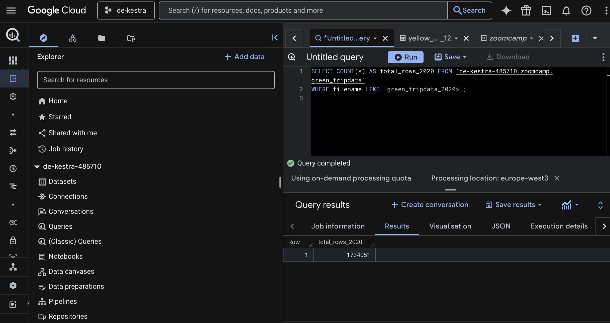
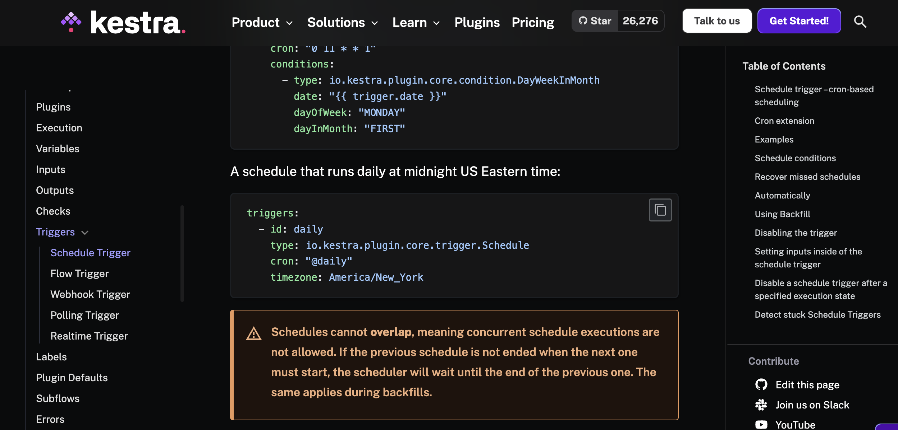

# Module 2 Homework - Workflow Orchestration

### Question 1: Within the execution for Yellow Taxi data for the year 2020 and month 12: what is the uncompressed file size (i.e. the output file `yellow_tripdata_2020-12.csv` of the extract task)?

### Question 2: What is the rendered value of the variable file when the inputs taxi is set to `green`, year is set to `2020`, and month is set to `04` during execution?

#### Answer: green_tripdata_2020-04.csv

### Question 3: How many rows are there for the `Yellow Taxi` data for all CSV files in the year `2020`?

#### Answer: 24,648,499

### Question 4: How many rows are there for the `Green Taxi` data for all CSV files in the year `2020`?

#### Answer: 1,734,051

### Question 5: How many rows are there for the `Yellow Taxi` data for the `March 2021` CSV file?

#### Answer: 1,925,152

### Question 6: How would you configure the timezone to New York in a Schedule trigger?

#### Answer: Set the `timezone` property to `America/New_York` in the `Schedule` trigger configuration.

